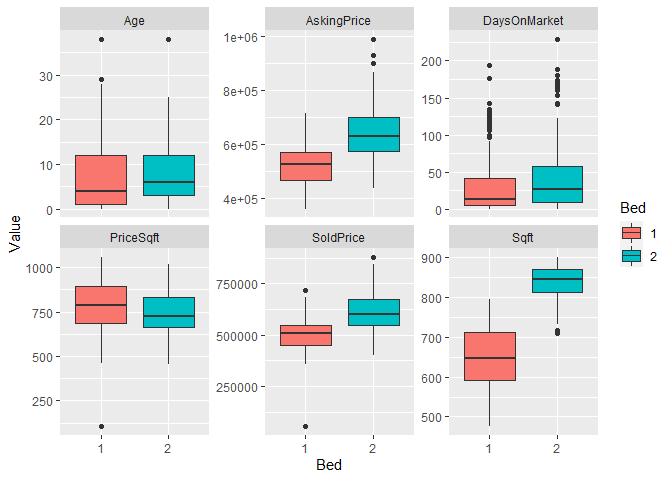
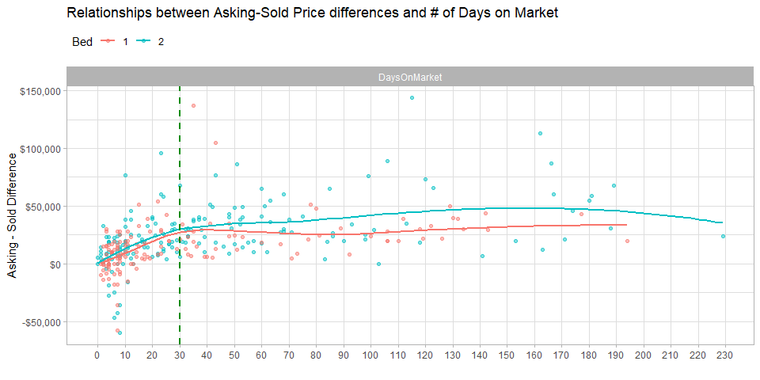
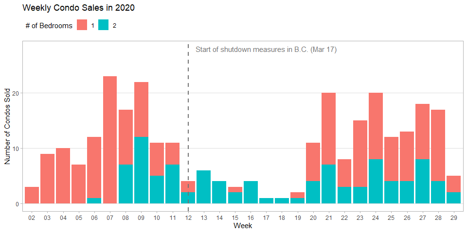
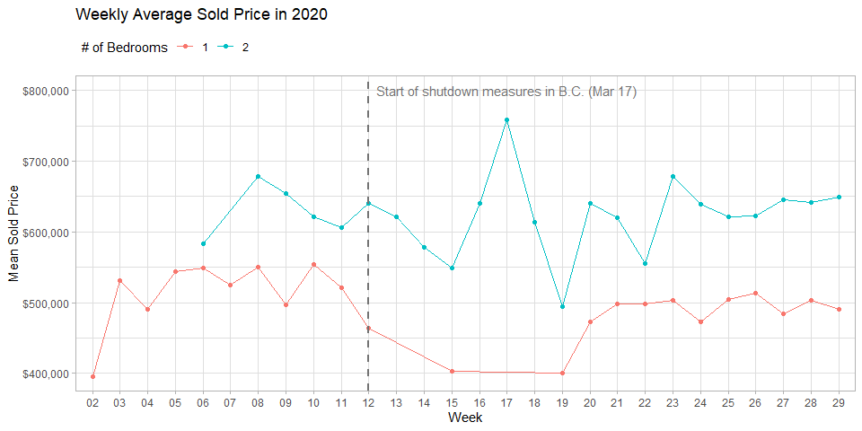
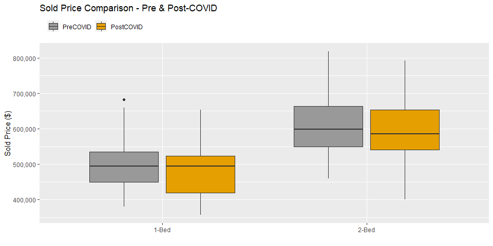

Real Estate Analysis
================
sho
7/28/2020

### Preliminary EDA on real estate data

The data used for this analysis was manually entered by the author
obtained from <https://www.zealty.ca/>.

<table>

<thead>

<tr>

<th style="text-align:right;">

Unit

</th>

<th style="text-align:left;">

Address

</th>

<th style="text-align:right;">

SoldPrice

</th>

<th style="text-align:right;">

AskingPrice

</th>

<th style="text-align:right;">

Bed

</th>

<th style="text-align:right;">

Bath

</th>

<th style="text-align:right;">

Sqft

</th>

<th style="text-align:right;">

Age

</th>

<th style="text-align:left;">

SoldDate

</th>

<th style="text-align:right;">

DaysOnMarket

</th>

<th style="text-align:right;">

PriceSqft

</th>

<th style="text-align:right;">

Floor

</th>

<th style="text-align:right;">

bargaindiff

</th>

</tr>

</thead>

<tbody>

<tr>

<td style="text-align:right;">

323

</td>

<td style="text-align:left;">

9288 Odlin Road

</td>

<td style="text-align:right;">

565700

</td>

<td style="text-align:right;">

588000

</td>

<td style="text-align:right;">

2

</td>

<td style="text-align:right;">

2

</td>

<td style="text-align:right;">

897

</td>

<td style="text-align:right;">

11

</td>

<td style="text-align:left;">

2020-07-13

</td>

<td style="text-align:right;">

6

</td>

<td style="text-align:right;">

630.6577

</td>

<td style="text-align:right;">

3

</td>

<td style="text-align:right;">

22300

</td>

</tr>

<tr>

<td style="text-align:right;">

1205

</td>

<td style="text-align:left;">

7488 Lansdowne Road

</td>

<td style="text-align:right;">

733000

</td>

<td style="text-align:right;">

768000

</td>

<td style="text-align:right;">

2

</td>

<td style="text-align:right;">

2

</td>

<td style="text-align:right;">

878

</td>

<td style="text-align:right;">

3

</td>

<td style="text-align:left;">

2020-07-17

</td>

<td style="text-align:right;">

21

</td>

<td style="text-align:right;">

834.8519

</td>

<td style="text-align:right;">

12

</td>

<td style="text-align:right;">

35000

</td>

</tr>

<tr>

<td style="text-align:right;">

417

</td>

<td style="text-align:left;">

23233 Gilley Road

</td>

<td style="text-align:right;">

525000

</td>

<td style="text-align:right;">

558888

</td>

<td style="text-align:right;">

2

</td>

<td style="text-align:right;">

2

</td>

<td style="text-align:right;">

850

</td>

<td style="text-align:right;">

0

</td>

<td style="text-align:left;">

2020-04-01

</td>

<td style="text-align:right;">

160

</td>

<td style="text-align:right;">

617.6471

</td>

<td style="text-align:right;">

4

</td>

<td style="text-align:right;">

33888

</td>

</tr>

<tr>

<td style="text-align:right;">

307

</td>

<td style="text-align:left;">

8033 Saba Road

</td>

<td style="text-align:right;">

595000

</td>

<td style="text-align:right;">

629000

</td>

<td style="text-align:right;">

2

</td>

<td style="text-align:right;">

2

</td>

<td style="text-align:right;">

862

</td>

<td style="text-align:right;">

10

</td>

<td style="text-align:left;">

2020-07-08

</td>

<td style="text-align:right;">

93

</td>

<td style="text-align:right;">

690.2552

</td>

<td style="text-align:right;">

3

</td>

<td style="text-align:right;">

34000

</td>

</tr>

<tr>

<td style="text-align:right;">

601

</td>

<td style="text-align:left;">

10155 River Drive

</td>

<td style="text-align:right;">

502500

</td>

<td style="text-align:right;">

509000

</td>

<td style="text-align:right;">

2

</td>

<td style="text-align:right;">

2

</td>

<td style="text-align:right;">

752

</td>

<td style="text-align:right;">

6

</td>

<td style="text-align:left;">

2020-03-10

</td>

<td style="text-align:right;">

7

</td>

<td style="text-align:right;">

668.2181

</td>

<td style="text-align:right;">

6

</td>

<td style="text-align:right;">

6500

</td>

</tr>

</tbody>

</table>

Summary statistics on sold price, asking price, price per sqft, sqft,
age, and \# of days on market were examined and compared between
one-bedroom apartments and two-bedroom apartments.

The plot below shows that while both the asking and sold price of
2-bedroom condos are higher than 1-bedroom condos, when divided by sqft,
the price per sqft is lower for 2-bedroom condos. This is mostly
contributed by 2-bedroom condos having an overall higher square footage
than 1-bedrooms (on average, 2-bedroom condos are 187.17 sqft larger
than 1-bedroom condos.)

<table class="kable_wrapper">

<tbody>

<tr>

<td>

<table>

<thead>

<tr>

<th style="text-align:left;">

</th>

<th style="text-align:left;">

SoldPrice

</th>

<th style="text-align:left;">

AskingPrice

</th>

<th style="text-align:left;">

Bed

</th>

<th style="text-align:left;">

Sqft

</th>

<th style="text-align:left;">

Age

</th>

<th style="text-align:left;">

DaysOnMarket

</th>

<th style="text-align:left;">

PriceSqft

</th>

</tr>

</thead>

<tbody>

<tr>

<td style="text-align:left;">

</td>

<td style="text-align:left;">

Min. :357000

</td>

<td style="text-align:left;">

Min. :361800

</td>

<td style="text-align:left;">

Min. :1

</td>

<td style="text-align:left;">

Min. :475.0

</td>

<td style="text-align:left;">

Min. : 0.000

</td>

<td style="text-align:left;">

Min. : 0.00

</td>

<td style="text-align:left;">

Min. : 103.9

</td>

</tr>

<tr>

<td style="text-align:left;">

</td>

<td style="text-align:left;">

1st Qu.:448000

</td>

<td style="text-align:left;">

1st Qu.:469000

</td>

<td style="text-align:left;">

1st Qu.:1

</td>

<td style="text-align:left;">

1st Qu.:591.0

</td>

<td style="text-align:left;">

1st Qu.: 1.000

</td>

<td style="text-align:left;">

1st Qu.: 5.00

</td>

<td style="text-align:left;">

1st Qu.: 683.5

</td>

</tr>

<tr>

<td style="text-align:left;">

</td>

<td style="text-align:left;">

Median :508000

</td>

<td style="text-align:left;">

Median :526000

</td>

<td style="text-align:left;">

Median :1

</td>

<td style="text-align:left;">

Median :646.0

</td>

<td style="text-align:left;">

Median : 4.000

</td>

<td style="text-align:left;">

Median : 13.00

</td>

<td style="text-align:left;">

Median : 786.8

</td>

</tr>

<tr>

<td style="text-align:left;">

</td>

<td style="text-align:left;">

Mean :507398

</td>

<td style="text-align:left;">

Mean :522629

</td>

<td style="text-align:left;">

Mean :1

</td>

<td style="text-align:left;">

Mean :650.3

</td>

<td style="text-align:left;">

Mean : 7.741

</td>

<td style="text-align:left;">

Mean : 31.15

</td>

<td style="text-align:left;">

Mean : 783.1

</td>

</tr>

<tr>

<td style="text-align:left;">

</td>

<td style="text-align:left;">

3rd Qu.:550000

</td>

<td style="text-align:left;">

3rd Qu.:570000

</td>

<td style="text-align:left;">

3rd Qu.:1

</td>

<td style="text-align:left;">

3rd Qu.:711.0

</td>

<td style="text-align:left;">

3rd Qu.:12.000

</td>

<td style="text-align:left;">

3rd Qu.: 41.00

</td>

<td style="text-align:left;">

3rd Qu.: 895.3

</td>

</tr>

<tr>

<td style="text-align:left;">

</td>

<td style="text-align:left;">

Max. :715900

</td>

<td style="text-align:left;">

Max. :715900

</td>

<td style="text-align:left;">

Max. :1

</td>

<td style="text-align:left;">

Max. :795.0

</td>

<td style="text-align:left;">

Max. :38.000

</td>

<td style="text-align:left;">

Max. :194.00

</td>

<td style="text-align:left;">

Max. :1058.2

</td>

</tr>

</tbody>

</table>

</td>

<td>

<table>

<thead>

<tr>

<th style="text-align:left;">

</th>

<th style="text-align:left;">

SoldPrice

</th>

<th style="text-align:left;">

AskingPrice

</th>

<th style="text-align:left;">

Bed

</th>

<th style="text-align:left;">

Sqft

</th>

<th style="text-align:left;">

Age

</th>

<th style="text-align:left;">

DaysOnMarket

</th>

<th style="text-align:left;">

PriceSqft

</th>

</tr>

</thead>

<tbody>

<tr>

<td style="text-align:left;">

</td>

<td style="text-align:left;">

Min. :400000

</td>

<td style="text-align:left;">

Min. :438000

</td>

<td style="text-align:left;">

Min. :2

</td>

<td style="text-align:left;">

Min. :709.0

</td>

<td style="text-align:left;">

Min. : 0.000

</td>

<td style="text-align:left;">

Min. : 0.00

</td>

<td style="text-align:left;">

Min. : 455.1

</td>

</tr>

<tr>

<td style="text-align:left;">

</td>

<td style="text-align:left;">

1st Qu.:550000

</td>

<td style="text-align:left;">

1st Qu.:573975

</td>

<td style="text-align:left;">

1st Qu.:2

</td>

<td style="text-align:left;">

1st Qu.:811.0

</td>

<td style="text-align:left;">

1st Qu.: 3.000

</td>

<td style="text-align:left;">

1st Qu.: 9.00

</td>

<td style="text-align:left;">

1st Qu.: 664.2

</td>

</tr>

<tr>

<td style="text-align:left;">

</td>

<td style="text-align:left;">

Median :602750

</td>

<td style="text-align:left;">

Median :629000

</td>

<td style="text-align:left;">

Median :2

</td>

<td style="text-align:left;">

Median :845.0

</td>

<td style="text-align:left;">

Median : 6.000

</td>

<td style="text-align:left;">

Median : 27.00

</td>

<td style="text-align:left;">

Median : 727.7

</td>

</tr>

<tr>

<td style="text-align:left;">

</td>

<td style="text-align:left;">

Mean :619565

</td>

<td style="text-align:left;">

Mean :645807

</td>

<td style="text-align:left;">

Mean :2

</td>

<td style="text-align:left;">

Mean :837.5

</td>

<td style="text-align:left;">

Mean : 7.855

</td>

<td style="text-align:left;">

Mean : 43.29

</td>

<td style="text-align:left;">

Mean : 740.5

</td>

</tr>

<tr>

<td style="text-align:left;">

</td>

<td style="text-align:left;">

3rd Qu.:675750

</td>

<td style="text-align:left;">

3rd Qu.:699900

</td>

<td style="text-align:left;">

3rd Qu.:2

</td>

<td style="text-align:left;">

3rd Qu.:870.0

</td>

<td style="text-align:left;">

3rd Qu.:12.000

</td>

<td style="text-align:left;">

3rd Qu.: 57.75

</td>

<td style="text-align:left;">

3rd Qu.: 831.1

</td>

</tr>

<tr>

<td style="text-align:left;">

</td>

<td style="text-align:left;">

Max. :880000

</td>

<td style="text-align:left;">

Max. :989000

</td>

<td style="text-align:left;">

Max. :2

</td>

<td style="text-align:left;">

Max. :900.0

</td>

<td style="text-align:left;">

Max. :38.000

</td>

<td style="text-align:left;">

Max. :229.00

</td>

<td style="text-align:left;">

Max. :1017.3

</td>

</tr>

</tbody>

</table>

</td>

</tr>

</tbody>

</table>

<!-- -->

The difference between asking and sold price is investigated further to
identify appropriate negotiation range. Considering there are some new
apartments in the data that could only be sold at asking price, those
were excluded in the following analysis.

Initial review of the data found minimal correlations between different
real estate variables and the bargained difference. The only variable
showing slightly higher correlation is asking price of 2-bedroom condos.

A logarithmic growth between the number of days on market and bargained
difference was noted, where the curve flattens after approximately 30
days on the market. This observation is found for both 1-bedroom and
2-bedroom apartments.

<table>

<thead>

<tr>

<th style="text-align:right;">

Bed

</th>

<th style="text-align:right;">

AvgDiff

</th>

<th style="text-align:right;">

MedianDiff

</th>

<th style="text-align:right;">

MinDiff

</th>

<th style="text-align:right;">

MaxDiff

</th>

</tr>

</thead>

<tbody>

<tr>

<td style="text-align:right;">

1

</td>

<td style="text-align:right;">

15403.77

</td>

<td style="text-align:right;">

14450

</td>

<td style="text-align:right;">

\-58000

</td>

<td style="text-align:right;">

137000

</td>

</tr>

<tr>

<td style="text-align:right;">

2

</td>

<td style="text-align:right;">

25377.65

</td>

<td style="text-align:right;">

20500

</td>

<td style="text-align:right;">

\-60000

</td>

<td style="text-align:right;">

144000

</td>

</tr>

</tbody>

</table>

<!-- -->

<!-- -->

### Impact of COVID on Real Estate Market

While the data collected from zealty.ca is not exhaustive of all sales
transactions occurring, a clear decline in the number of sales was
observed starting at week 12 (week of March 16). March 17th marked the
day B.C. declared state of emergency due to COVID-19. Sales transactions
started to pick up once again around week 20 (week of May 10). This
pattern was not observed in the weekly average sold price.

<!-- --><!-- -->

A more in-depth comparison between pre and post COVID sold price was
examined and no significant changes were observed for either one bedroom
or two bedroom.

<!-- -->

    ## 
    ##  Paired t-test
    ## 
    ## data:  pre_2 and post_2
    ## t = 0.67924, df = 55, p-value = 0.4998
    ## alternative hypothesis: true difference in means is not equal to 0
    ## 95 percent confidence interval:
    ##  -21101.07  42738.57
    ## sample estimates:
    ## mean of the differences 
    ##                10818.75

    ## 
    ##  Paired t-test
    ## 
    ## data:  pre_1 and post_1
    ## t = 2.1468, df = 67, p-value = 0.03544
    ## alternative hypothesis: true difference in means is not equal to 0
    ## 95 percent confidence interval:
    ##   1681.99 46219.89
    ## sample estimates:
    ## mean of the differences 
    ##                23950.94
