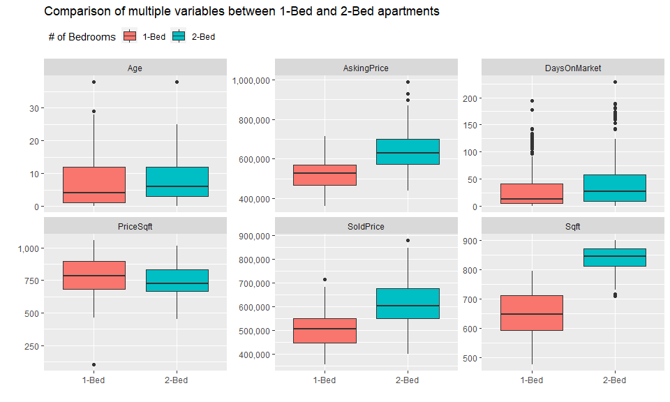

Real Estate Analysis
================
sho
7/28/2020

### Preliminary EDA on real estate data

The data used for this analysis was manually entered by the author
obtained from <https://www.zealty.ca/>.

| Unit | Address             | SoldPrice | AskingPrice | Bed | Bath | Sqft | Age | SoldDate  | DaysOnMarket | PriceSqft | Floor | bargaindiff |
| ---: | :------------------ | --------: | ----------: | --: | ---: | ---: | --: | :-------- | -----------: | --------: | ----: | ----------: |
|  323 | 9288 Odlin Road     |    565700 |      588000 |   2 |    2 |  897 |  11 | 7/13/2020 |            6 |  630.6577 |     3 |       22300 |
| 1205 | 7488 Lansdowne Road |    733000 |      768000 |   2 |    2 |  878 |   3 | 7/17/2020 |           21 |  834.8519 |    12 |       35000 |
|  417 | 23233 Gilley Road   |    525000 |      558888 |   2 |    2 |  850 |   0 | 4/1/2020  |          160 |  617.6471 |     4 |       33888 |
|  307 | 8033 Saba Road      |    595000 |      629000 |   2 |    2 |  862 |  10 | 7/8/2020  |           93 |  690.2552 |     3 |       34000 |
|  601 | 10155 River Drive   |    502500 |      509000 |   2 |    2 |  752 |   6 | 3/10/2020 |            7 |  668.2181 |     6 |        6500 |

Summary statistics on sold price, asking price, price per sqft, sqft,
age, and \# of days on market were examined and compared between
one-bedroom apartments and two-bedroom apartments.

The plot below shows that while both the asking and sold price of
2-bedroom condos are higher than 1-bedroom condos, when divided by sqft,
the price per sqft is lower for 2-bedroom condos. This is mostly
contributed by 2-bedroom condos having an overall higher square footage
than 1-bedrooms (on average, 2-bedroom condos are 187.17 sqft larger
than 1-bedroom condos.)

    ## $`1`
    ##    SoldPrice       AskingPrice          Bed         Sqft            Age        
    ##  Min.   :357000   Min.   :361800   Min.   :1   Min.   :475.0   Min.   : 0.000  
    ##  1st Qu.:448000   1st Qu.:469000   1st Qu.:1   1st Qu.:591.0   1st Qu.: 1.000  
    ##  Median :508000   Median :526000   Median :1   Median :646.0   Median : 4.000  
    ##  Mean   :507398   Mean   :522629   Mean   :1   Mean   :650.3   Mean   : 7.741  
    ##  3rd Qu.:550000   3rd Qu.:570000   3rd Qu.:1   3rd Qu.:711.0   3rd Qu.:12.000  
    ##  Max.   :715900   Max.   :715900   Max.   :1   Max.   :795.0   Max.   :38.000  
    ##   DaysOnMarket      PriceSqft     
    ##  Min.   :  0.00   Min.   : 103.9  
    ##  1st Qu.:  5.00   1st Qu.: 683.5  
    ##  Median : 13.00   Median : 786.8  
    ##  Mean   : 31.15   Mean   : 783.1  
    ##  3rd Qu.: 41.00   3rd Qu.: 895.3  
    ##  Max.   :194.00   Max.   :1058.2  
    ## 
    ## $`2`
    ##    SoldPrice       AskingPrice          Bed         Sqft            Age        
    ##  Min.   :400000   Min.   :438000   Min.   :2   Min.   :709.0   Min.   : 0.000  
    ##  1st Qu.:550000   1st Qu.:573975   1st Qu.:2   1st Qu.:811.0   1st Qu.: 3.000  
    ##  Median :602750   Median :629000   Median :2   Median :845.0   Median : 6.000  
    ##  Mean   :619565   Mean   :645807   Mean   :2   Mean   :837.5   Mean   : 7.855  
    ##  3rd Qu.:675750   3rd Qu.:699900   3rd Qu.:2   3rd Qu.:870.0   3rd Qu.:12.000  
    ##  Max.   :880000   Max.   :989000   Max.   :2   Max.   :900.0   Max.   :38.000  
    ##   DaysOnMarket      PriceSqft     
    ##  Min.   :  0.00   Min.   : 455.1  
    ##  1st Qu.:  9.00   1st Qu.: 664.2  
    ##  Median : 27.00   Median : 727.7  
    ##  Mean   : 43.29   Mean   : 740.5  
    ##  3rd Qu.: 57.75   3rd Qu.: 831.1  
    ##  Max.   :229.00   Max.   :1017.3

<!-- -->

The difference between asking and sold price is investigated further to
identify appropriate negotiation range. Considering there are some new
apartments in the data that could only be sold at asking price, those
were excluded in the following analysis.

| Bed |  AvgDiff | MedianDiff | MinDiff | MaxDiff |
| --: | -------: | ---------: | ------: | ------: |
|   1 | 15403.77 |      14450 | \-58000 |  137000 |
|   2 | 25377.65 |      20500 | \-60000 |  144000 |

<!-- -->
